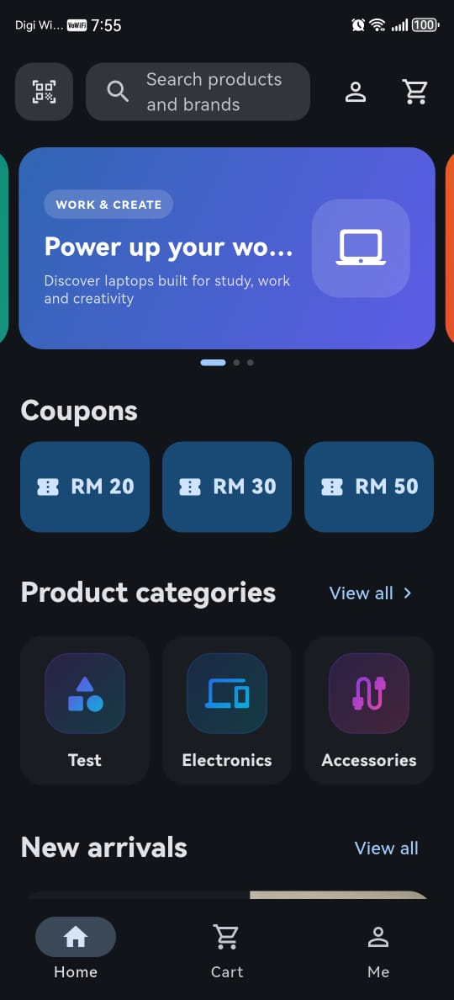
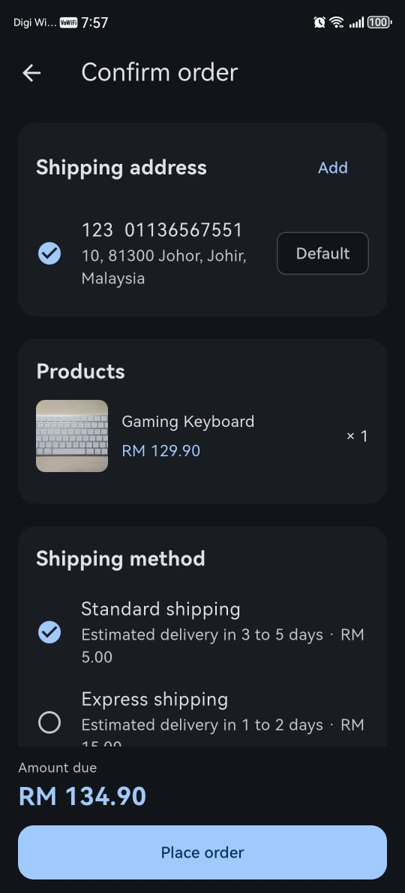
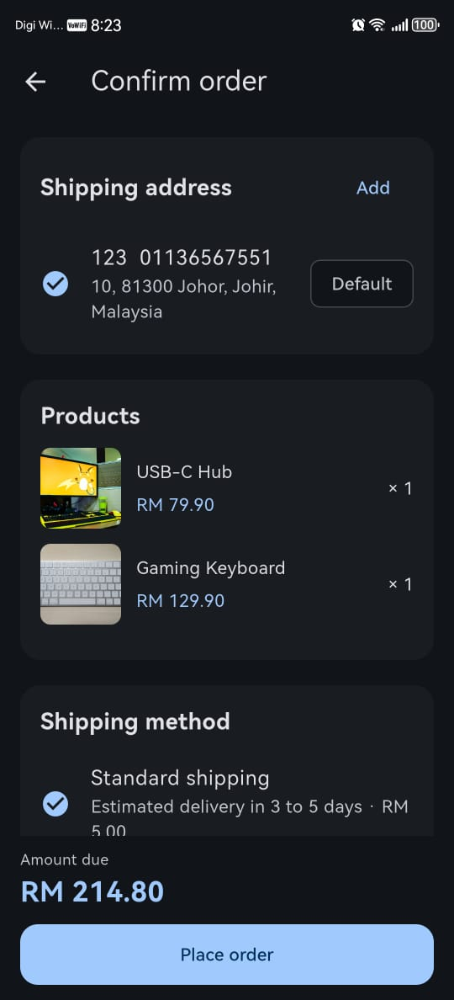
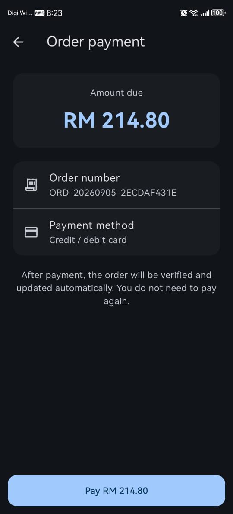
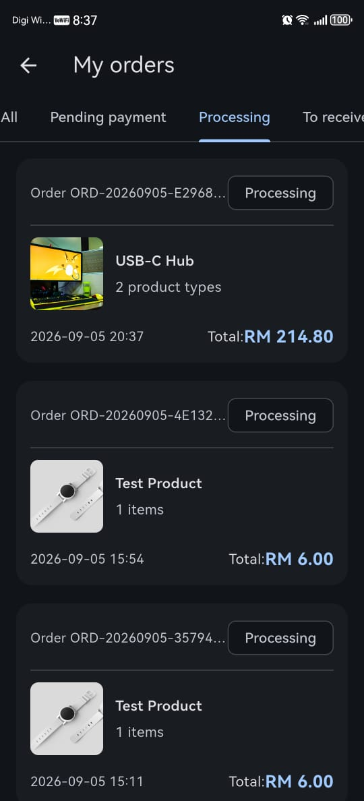
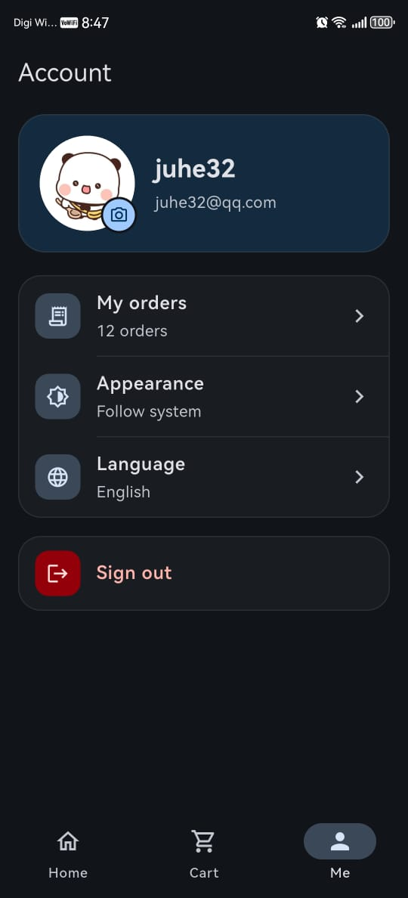
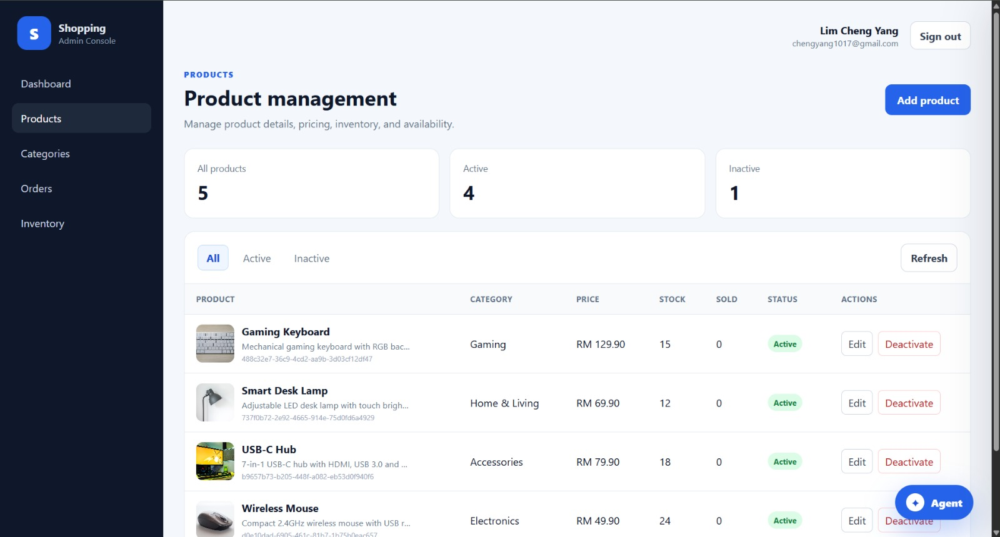
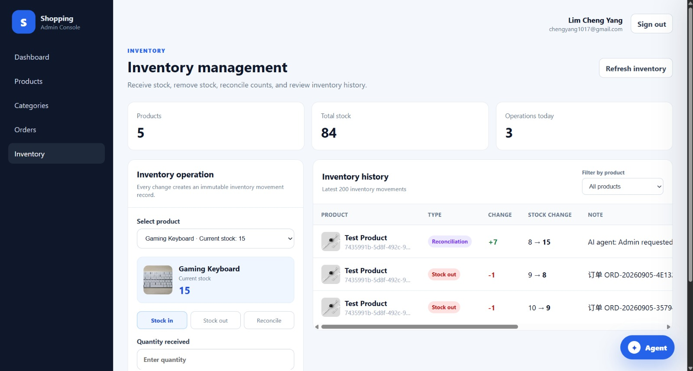

# Commerce Platform

**English | [简体中文](README.zh-CN.md)**

A full-stack e-commerce platform with a **Flutter customer app**, **React admin dashboard**, and **Node.js / Express backend** backed by **Prisma, PostgreSQL, and Stripe**.

This project is built as a monorepo to demonstrate a complete commerce workflow rather than a standalone UI demo: customers can browse products, manage a cart, check out, pay, and track orders, while administrators manage products, categories, inventory, and orders through a separate dashboard.

---

## Screenshots

### Mobile Storefront

<p align="center">
  
  
  
</p>

### Orders

<p align="center">
  
  
  
</p>

### Admin Dashboard

<p align="center">
  
</p>

### Inventory Management

<p align="center">
  
</p>

---

## What It Includes

### Flutter Customer App

Located in `apps/mobile`.

- Customer authentication
- Product browsing and categories
- Product details
- Shopping cart
- Checkout
- Address management
- Stripe payment flow
- Order history and details
- Light / dark / system theme
- English and Simplified Chinese localization

The Flutter app uses **BLoC / Cubit** for state management and separates presentation from repositories and services.

### React Admin Dashboard

Located in `apps/admin`.

- Admin authentication
- Protected routes
- Product management
- Category management
- Order management
- Inventory management
- Inventory movement history
- Access-token refresh flow

Built with **React, TypeScript, Vite, React Router, and Axios**.

### Node.js Backend

Located in `server`.

- Authentication
- Product and category APIs
- Customer and admin order APIs
- Inventory operations
- Stripe integration
- Business logic
- Prisma database access

Built with **Node.js, TypeScript, Express, Prisma ORM, PostgreSQL, Argon2, JOSE, and Stripe**.

---

## Architecture

```text
Flutter Customer App
        │
        │ REST API
        ▼
Node.js / Express API
        │
   ┌────┴────┐
   │         │
   ▼         ▼
Prisma     Stripe
   │
   ▼
PostgreSQL
   ▲
   │ REST API
   │
React Admin Dashboard
```

Both frontend applications communicate with the same backend and business domain.

A typical customer product flow is:

```text
Flutter UI
   ↓
ProductCubit
   ↓
Repository
   ↓
Service
   ↓
REST API
   ↓
Express
   ↓
Prisma
   ↓
PostgreSQL
```

---

## Flutter State Management

Major Cubits include:

```text
CustomerAuthCubit
ProductCubit
CartCubit
CheckoutCubit
OrderCubit
PaymentCubit
LocaleCubit
ThemeModeCubit
```

Derived state such as totals is kept separate from UI widgets, while mutations notify the appropriate state layer and cause the UI to rebuild from current state.

---

## Payments

Stripe is integrated through the backend.

The client can initiate the payment flow, but the backend remains the authoritative source for payment state. This avoids treating a client-side submission as final confirmation before server-side verification.

---

## Inventory

The administration side includes inventory tracking and movement history, allowing stock changes to be recorded rather than only overwriting a single quantity value.

Example administration routes include:

```text
GET  /api/admin/inventory/movements
POST /api/admin/inventory/movements
```

---

## Authentication

The project separates customer and administrator authentication concerns.

The admin dashboard uses protected routes and an access-token refresh flow, while the backend handles credential verification and authorization-related business logic.

---

## Tech Stack

### Mobile

- Flutter
- Dart
- flutter_bloc
- Firebase services
- Flutter Stripe
- SharedPreferences
- Flutter Secure Storage
- Flutter Localizations / Intl

### Admin

- React
- TypeScript
- Vite
- React Router
- Axios

### Backend

- Node.js
- TypeScript
- Express
- Prisma ORM
- PostgreSQL
- Stripe
- Argon2
- JOSE

---

## Monorepo Structure

```text
fullstack-commerce-platform/
├── apps/
│   ├── mobile/        # Flutter customer application
│   └── admin/         # React administration dashboard
├── server/            # Node.js / Express API
├── firebase.json
└── README.md
```

---

## Getting Started

### Flutter customer app

```bash
cd apps/mobile
flutter pub get
flutter analyze
flutter run
```

### React admin dashboard

```bash
cd apps/admin
npm install
npm run dev
```

Build:

```bash
npm run build
```

### Backend

```bash
cd server
npm install
npm run typecheck
npm run dev
```

The backend requires environment configuration for services such as PostgreSQL and Stripe. Real secrets should never be committed.

---

## Why This Project Exists

This repository is intended to demonstrate a complete product flow across multiple layers:

```text
Mobile UI
  +
State Management
  +
REST API
  +
Authentication
  +
Payments
  +
Orders
  +
Inventory
  +
Admin Dashboard
  +
Database
```

It is designed as a practical full-stack commerce project rather than a collection of disconnected demo screens.

---

## Status

**Active development.**

The core customer shopping flow, administration modules, backend API, authentication, orders, inventory, localization, themes, and payment integration are implemented. Current work focuses on UI polish, architecture refinement, testing, deployment, and production readiness.
